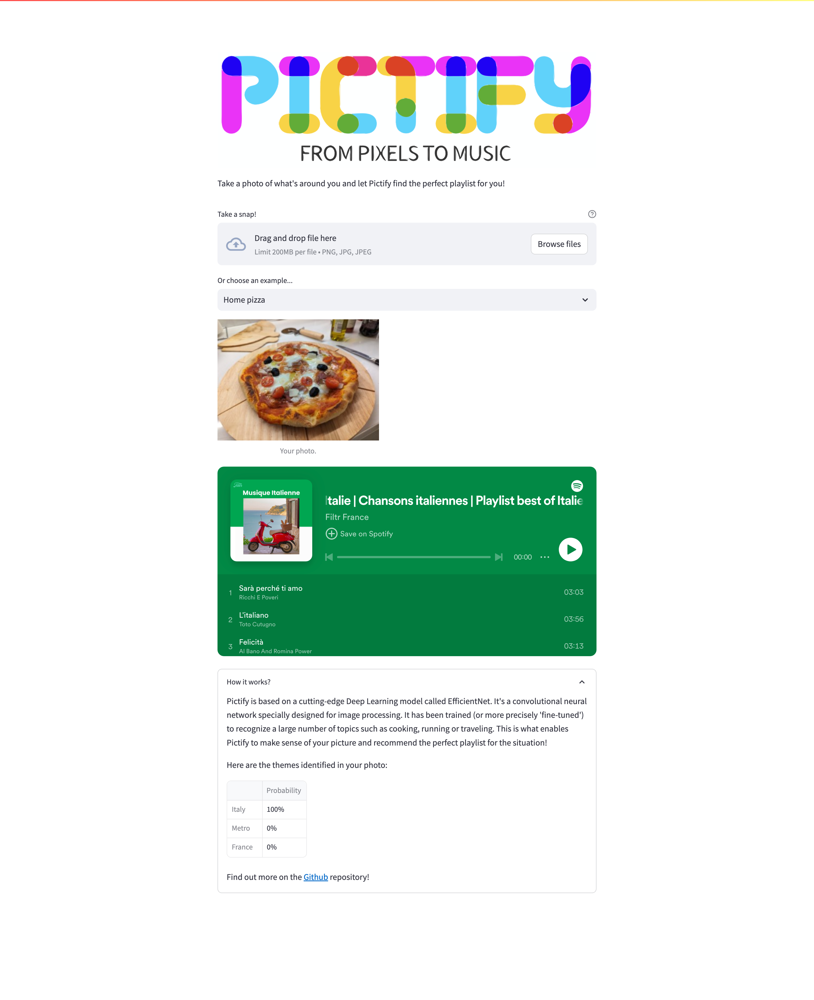

# Pictify

Pictify is a tiny Computer Vision project whose aim is to recommend a music playlist based on what the user takes a photo of. The idea is to fine-tune a pre-trained model to recognize a pre-defined set of themes, each associated with a Spotify playlist. This project will involve three main parts: data acquisition, model fine-tuning and application deployment.

If you want to give a try to the application, please header [here](https://pictify.louisguichard.fr/)!

## Screenshot 

    

